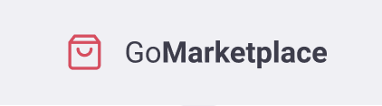

<p align="left">
   
</p>

# Go Marketplace

> A mobile app of a marketplace prototype.

[](https://github.com/jennifertakagi)
[](#)
[](https://github.com/jennifertakagi/go-marketplace/stargazers)
[](https://github.com/jennifertakagi/go-marketplace/network/members)
[](https://github.com/jennifertakagi/go-marketplace/graphs/contributors)

---

# :pushpin: Table of Contents

* [Features](#rocket-features)
* [UI Documentation](#framed_picture-ui-documentation)
* [Installation](#construction_worker-installation)
* [Getting Started](#runner-getting-started)
* [FAQ](#postbox-faq)
* [Found a bug? Missing a specific feature?](#bug-issues)
* [Contributing](#tada-contributing)
* [License](#closed_book-license)

<br />

# :rocket: Features

* Check the products on dashboard
* Add items on your cart
* Increase and decrease quantity product on cart

# :framed_picture: UI Documentation
This project has a UI Documentation of reusable components, allowing to test them individually.

<p align="left">
   
</p>


# :construction_worker: Installation

**You need to install [YARN](https://yarnpkg.com/) and [Xcode](https://apps.apple.com/us/app/xcode/id497799835?mt=12) + [COCOAPODS](https://cocoapods.org/)or [EXPO](https://expo.io/) first, then in order to clone the project via HTTPS, run this command:**

```git clone https://github.com/jennifertakagi/go-marketplace.git```

SSH URLs provide access to a Git repository via SSH, a secure protocol. If you have a SSH key registered in your Github account, clone the project using this command:

```git clone git@github.com:jennifertakagi/go-marketplace.git```

**Install dependencies**

You need to install the dependencies, so **run the above command on root and in each of this folders**:

```yarn```

In case you're using Macbook, please run the line above on **ios** folder:

```pod install```

# :runner: Getting Started

Run the following command to start the application in a development environment:

```yarn ios | android```


# :postbox: Faq

**Question:** What are the technologies used in this project?

**Answer:** The technologies used in this project are [React Native](https://reactnative.dev/) and [Styled-Components](https://styled-components.com/).

# :bug: Issues

Feel free to **file a new issue** with a respective title and description on the [Go Marketplace](https://github.com/jennifertakagi/go-marketplace/issues) repository. If you already found a solution to your problem, **i would love to review your pull request**! Have a look at our [contribution guidelines](https://github.com/jennifertakagi/go-marketplace/blob/master/CONTRIBUTING.md) to find out about the coding standards.

# :tada: Contributing

Check out the [contributing](https://github.com/jennifertakagi/go-marketplace/blob/master/CONTRIBUTING.md) page to see the best places to file issues, start discussions and begin contributing.

# :closed_book: License

Released in 2021.
This project is under the [MIT license](https://github.com/jennifertakagi/go-marketplace/master/LICENSE).

